# Fake Instagram
Целью данного курсового проекта является разработка клиент-серверного приложения, являющегося аналогом популярного приложения Instagram и имеющего аналогичный функционал. Приложение позволяет добавлять фото в личный аккаунт, просматаривать публикации других пользователей приложения. Есть возможность редактировать информацию в профиле, подписки, смотреть профили других пользователей, оценивание и комментирование постов других польхователей.

Мобильное приложение разработано под ОС Android на языке Java. Сервер разработан на ASP.NET Core WEB Api. Для хранения пользовательских данных используется Реляционная база данных MS SQL Server.

Полный функционал приложения описан ниже:
- Вход по отпечатку;
- Регистрация пользователя;
- Ввод данных пользователя;
- Авторизация пользователя;
- Просмотр публикаций других пользователей;
- Просмотр профилей других пользователей;
- Осуществление доступ к директориям с фотографиями на устройстве;
- Получение уведомлений при успешной публикации;
- Добавление фото с описанием на сервер;
- Просмотр своего профиля;
- Редактирование своего профиля;
- Просмотр своей публикации;
- Комментирование чужих публикаций;
- Оценивание чужих публикаemailций
- Подписки на других пользователей
- Отображение записей, добавленных только аккаунтами, на которые вы подписаны

Ниже продемонстрирован функционал приложения:

При запуске:

Открывается форма авторизации пользователя. <br>_На данном экране стоит запрет создания скриншотов во избежание случаев кражи авторизацмонных данных (на время тестирования запрет был отключен для демонстрации экрана). Также, здесь стоит обработчик нажатия кнопки "Назад" (onBackPressed), при срабатывании которого завершается сессия приложения._<br>
В случае, если у пользователя есть аккаунт, то он вводит авторизационные данные в соответствующие поля, иначе нужно нажать на фиолетовую надпись под кнопкой входа для перехода на страницу Регистрации :

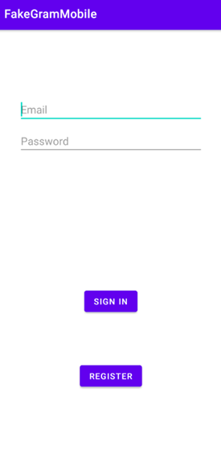
<br>

_На данном экране стоит запрет создания скриншотов во избежание случаев кражи авторизацмонных данных (на время тестирования запрет был отключен для демонстрации экрана)._<br>
Для регистрации необходимо ввести все данные, указанные в данной форме. Сервер проверит, существует ли пользователь с таким именем и выведет соответствующее сообщение в случае совпадения имен.

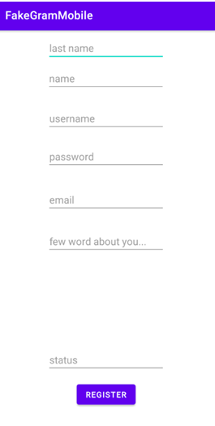
<br>
Так же вы должны подтвердить свой email
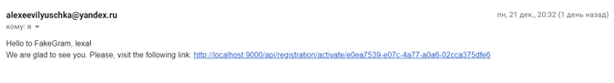
<br>

_На данном экране стоит обработчик нажатия кнопки "Назад" (onBackPressed), при срабатывании которого завершается сессия приложения._<br>
При входе в аккаунт пользователю отображается лента публикаций. Лента обновляется с помощью перетягивания вниз. После загрузки отображаются публикации пользователей, на которых была произведена подписка. Процесс подписки так же указан на скриншоте

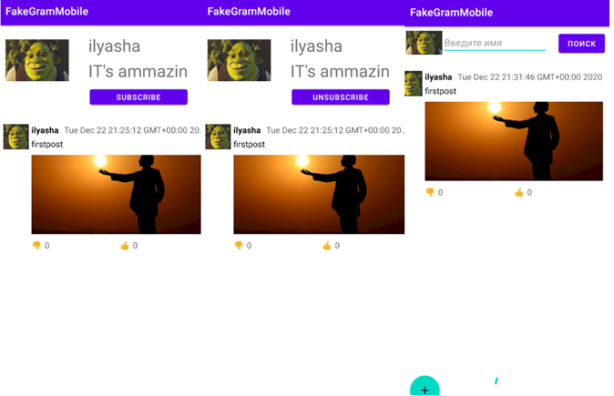
<br>
<br>
Для добавления новой публикации необходимо нажать кнопку "+" в нижнем меню. Откроется экран, в котором необходимо будет ввести данные о публикации и выбрать фотографию. На скриншоте отображен процесс создания публикации:

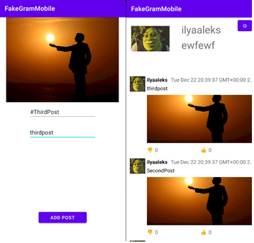
<br>


Так же пользователю приходит уведомление в случае успешной публикации:

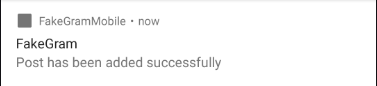
<br>

Пользователь имеет возможность посетить свой профиль. Там отображается его личная информация, публикации, их количество, а также имеет кнопка для редактирования профиля:

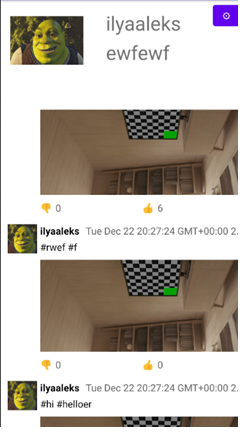
<br>

При нажатии на публикацию в профиле открывается экран с публикацией, позволяющий более детально рассмотреть фото, а также посмотреть описание фотографии и оценки.

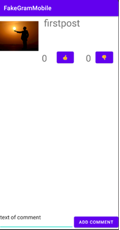
<br>


При переходе в окно редактирования профиля предоставляются текстовые поля с введенными нынешними данными. При изменении своих данных и сохранении данные пользователя обновятся:

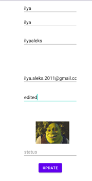
<br>

Также, из ленты, по долгому тапу, можно попасть в профили других пользователей:

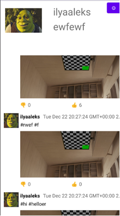
<br>

Пароли пользователей хранятся в базе данных в хешированном виде:

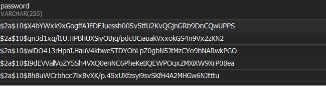
<br>

Чуть более подробная информация о приложении находится в курсовой записке в разделе руководства пользователя на 23 странице
========================

Код серверной части приложения можно найти в [данном](https://github.com/ilyaaleks/course_project_in_university/tree/master/src/main/java/org/belstu/fakegram/FakeGram) репозитории
========================
Все методы сервиса работают в рамках отдельных транзакций, и достигается это путем добавление аннотации `@Transactional`
========================
В проекте применена обфускация с использованием Proguard.


_Запрет создания скриншотов осуществляется путём размещения следующего кода в файле кода Activity:_

```getWindow().setFlags(LayoutParams.FLAG_SECURE, LayoutParams.FLAG_SECURE);```

_Использование функционала управления сессией приложения заключается в следующем:_
- _Определение, авторизован ли пользователь, и в зависимости от этого ему открывается либо экран авторизации, либо сразу новостная лента. Для этого используется SharedPreferences._
- _Завершение сессии приложения при нажатии кнопки "Назад"_

Реализованы следубщие требования:
- Регистрация пользователей
- Отправка изображений на сервер
- Добавление описания к публикации
- Авторизация при входе в приложение
- Отправка уведомлений
- Возможность оценивать и комментировать фотографии пользователей
- Локальное сохранение копий записей
- Шифрование БД
- Управление транзакциями на уровне сервера

А также:
- Минимальное количество экранов 8+
- Использование защиты паролей при хранении в базе данных
- Управление сессией приложения
- Запрет создания скриншотов
- Обфускация

